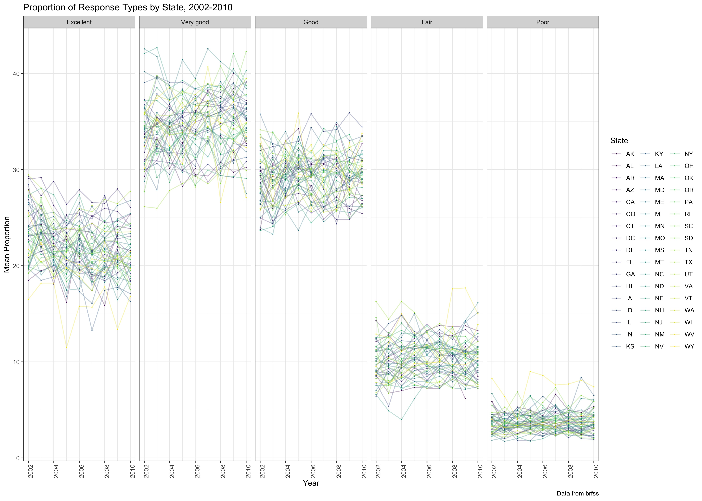
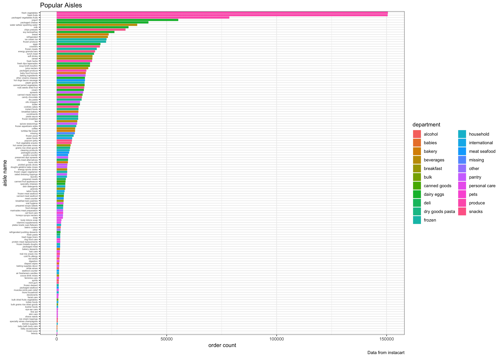

```{r setup}
library(tidyverse)
library(p8105.datasets)
library(ggthemes)
```

## Problem 1

Load BRFSS data

```{r brfss data, cache=TRUE}
data(brfss_smart2010)

brfss_smart2010 <- brfss_smart2010 %>% 
  janitor::clean_names() %>% 
  rename(state = locationabbr, state_and_county = locationdesc) %>% 
  filter(topic == "Overall Health", !is.na(response)) %>%
  mutate(response = factor(response, levels = c("Excellent", "Very good", "Good", "Fair", "Poor")))

```

_In 2002, which states were observed at 7 locations?_

```{r seven locations}
knitr::kable(brfss_smart2010 %>% 
  filter(year == 2002) %>% 
  group_by(state) %>% 
  distinct(state_and_county) %>% 
  tally() %>% 
  filter(n == 7)
)
```

Connecticut, Florida, and North Carolina were observed at 7 distinct locations in 2002.

_Make a “spaghetti plot” that shows the number of locations in each state from 2002 to 2010._

```{r spaghetti}
#Save number of locations data in each state
number_locations <- brfss_smart2010 %>% 
  group_by(state, year) %>% 
  distinct(state_and_county, year) %>% 
  add_tally()

left_join(brfss_smart2010, number_locations) %>% 
  rename(n_unique_locations = n) %>%
  distinct(year, state, n_unique_locations) %>% 
  ggplot(aes(x = year, y = n_unique_locations)) +
  geom_line(aes(color = state)) + 
  theme_bw() + 
  labs(
    title = "Locations Responding to BRFSS by State, 2002-2010",
    x = "Number of Locations",
    y = "Year",
    caption = "Data from brfss"
  ) + 
  viridis::scale_color_viridis(
    name = "State", 
    discrete = TRUE
    )
```


_Make a table showing, for the years 2002, 2006, and 2010, the mean and standard deviation of the proportion of “Excellent” responses across locations in NY State._

```{r mean sd excellent}
brfss_smart2010 %>%
  filter(response == "Excellent", year == 2002 | year == 2006 | year == 2010) %>% 
  group_by(state, year) %>% 
  summarize(mean = mean(data_value), sd = sd(data_value))
```

_For each year and state, compute the average proportion in each response category (taking the average across locations in a state). Make a five-panel plot that shows, for each response category separately, the distribution of these state-level averages over time._

```{r}
brfss_smart2010 %>%
  group_by(state, year, response) %>% 
  summarize(mean = mean(data_value)) %>% 
  ggplot(aes(x = year, y = mean)) +
  geom_point(aes(color = state), size = .1) +
  geom_line(aes(color = state), alpha = .3) + 
  facet_grid( ~ response)  +
  theme_bw() + 
  theme(axis.text.x = element_text(angle = 90, hjust = 1)) +
  labs(
    title = "Proportion of Response Types by State, 2002-2010",
    x = "Year",
    y = "Mean Proportion",
    caption = "Data from brfss"
  ) + 
  viridis::scale_color_viridis(
    name = "State", 
    discrete = TRUE
    ) 

ggsave("brfss_plot.jpg", scale = 2)

```

That's a small version, so I'm printing a more-readable one below (from the saved plot):

```{r brfss plot printed, out.width = '100%'}

```

## Problem 2

This problem uses the Instacart data. DO NOT include this dataset in your local data directory; instead, load the data from the  p8105.datasets package (it’s called instacart).

```{r load instacart, cache = TRUE}
data(instacart)
```


_The goal is to do some exploration of this dataset. To that end, write a short description of the dataset, noting the size and structure of the data, describing some key variables, and giving illustrative examples of observations._

This large dataset contains information from Instacart, an online grocery service. Each of the `r nrow(instacart)` observations is an individual product ordered in a given order, with associated contextual information about the following:

* the user, such as the days since the user has made a prior order and their ID

* order session info, such as the index of the order in which the product was added into the cart for the given order session, and the order session's hour of day and day of week

* the product, such as its ID, aisle, and department.

The largest order in this dataset is `r max(instacart$add_to_cart_order)` items (using add to cart order as a proxy)! The median time of order for individual products is `r median(instacart$order_hour_of_day) -12` p.m. `r nrow(instacart %>% distinct(department))` departments are represented in the data, the most popular of which is `r instacart %>% summarize(most_popular = names(which.max(table(department))))`. The least popular is the `r instacart %>% summarize (least_popular = names(which.min(table(department))))` goods department.

There are `r nrow(instacart %>% distinct(aisle))` aisles represented in the data, the most popular of which is `r instacart %>% summarize(most_popular = names(which.max(table(aisle))))`. The least popular is the `r instacart %>% summarize (least_popular = names(which.min(table(aisle))))` aisle.


_Make a plot that shows the number of items ordered in each aisle. Order aisles sensibly, and organize your plot so others can read it._

```{r plot number items ordered in each aisle}
instacart %>%
  group_by(department, aisle, aisle_id) %>% 
  tally() %>% 
  ungroup() %>% 
  mutate(aisle = factor(aisle, levels = aisle[order(n)])) %>% 
  ggplot(aes(x = aisle, y = n, fill = department)) +
  geom_col() + 
  coord_flip() +
  theme_bw() + 
  theme(axis.text.y = element_text(size = rel(0.5))) +
  labs(
    title = "Popular Aisles",
    x = "aisle name",
    y = "order count",
    caption = "Data from instacart"
  ) + 
  viridis::scale_color_viridis(
    name = "Department", 
    discrete = TRUE
    ) 


ggsave("instacart_plot.jpg", scale = 2)
```

That's a small version, so I'm printing a more-readable one below (from the saved plot):

```{r instacart plot printed, out.width = '100%'}

```
  

_Make a table showing the most popular item in each of the aisles “baking ingredients”, “dog food care”, and “packaged vegetables fruits”._

```{r most popular item in }
baking <- instacart %>% 
  filter(aisle == "baking ingredients") %>% 
  summarize(most_popular = names(which.max(table(product_name))))

dog_food <- instacart %>% 
  filter(aisle == "dog food care") %>% 
  summarize(most_popular = names(which.max(table(product_name))))

veg_fruit <- instacart %>% 
  filter(aisle == "packaged vegetables fruits") %>% 
  summarize(most_popular = names(which.max(table(product_name))))

knitr::kable(rbind(baking, dog_food, veg_fruit) %>% 
  mutate(aisle = c("baking ingredients", "dog food care", "packaged vegetables fruits"))
)
```


_Make a table showing the mean hour of the day at which Pink Lady Apples and Coffee Ice Cream are ordered on each day of the week; format this table for human readers (i.e. produce a 2 x 7 table)._

```{r}
instacart %>% 
    filter(product_name == "Pink Lady Apples" | product_name == "Coffee Ice Cream") %>%
    group_by(order_dow, product_name) %>% 
    summarize(mean_hour = mean(order_hour_of_day)) %>% 
    ungroup() %>% 
    arrange(product_name) %>% 
    spread(key = product_name, value = mean_hour) %>% 
    mutate(order_dow = replace(order_dow, 1:7, c("sunday", "monday", "tuesday", "wednesday", "thursday", "friday", "saturday"))) %>% 
    rename('Order Day of Week' = order_dow) %>% 
  knitr::kable(caption = "Mean Hour of Day Order Placed (x/24h)")
```

## Problem 3

This problem uses the NY NOAA data. DO NOT include this dataset in your local data directory; instead, load the data from the  p8105.datasets package (it’s called ny_noaa).

```{r load noaa, cache = TRUE}
data(ny_noaa)
            
```

This dataset is composed of weather station data in NY state. The key variables are `prcp`, or precipitation; `snow`, or snowfall; `snwd`, or snow depth; and `tmax`/`tmin`, or maximum and minimum temperature. THe ID of the weather station as well as the date of data collection (data is day-level) is also present.  This dataset has `r nrow(ny_noaa)` observations, but a good deal of missing data. A table of missing data is below:

```{r}
ny_noaa %>% 
  map_df(function(x) sum(is.na(x))) %>%
  gather(feature, num_nulls) %>% 
  mutate(percent_nulls = 100*num_nulls/nrow(ny_noaa)) %>% 
  knitr::kable()
```

Nearly half of the observations in the dataset have missing temperature data. Such a high null value might be a result of systematic lack of data collection rather than aberrations. Other abberations also seem to be present. Precipitation data is the most reliably present in the dataset. The max observed value for precipitation is `r max(ny_noaa$prcp, na.rm = TRUE)`, and for snowfall is `r max(ny_noaa$snow, na.rm = TRUE)`. Both max values seem very high for precipitation; but checking the source for the data, the units of precipitation are in tenths of a millimeter and for snowfall are in millimeters.It also seems off that there would be a negative number for snowfall, although perhaps this represents measurement of snowmelt. 

Similarly, the temperature data is in tenths of a degree Celsius. The temperature sensors are very sensitive, but possibly become less accurate on certain temperatures; we see similar maximum values for `tmax` and `tmin`. It looks like the "600" value, or 60ºC, is a ceiling, appearing 34 times in both variables.

```{r}
ny_noaa %>% 
  mutate(tmax = as.numeric(tmax), tmin = as.numeric(tmin)) %>% 
  summarize(median_tmax = median(tmax, na.rm = TRUE),
            IQR_tmax = IQR(tmax, na.rm = TRUE),
            max_tmax = max(tmax, na.rm = TRUE),
            min_tmax = min(tmax, na.rm = TRUE),
            count_600 = sum(ifelse(tmax == 600, 1, 0), na.rm = TRUE)
              ) %>% 
  knitr::kable()

ny_noaa %>% 
  mutate(tmax = as.numeric(tmax), tmin = as.numeric(tmin)) %>% 
  summarize(median_tmin = median(tmin, na.rm = TRUE),
            IQR_tmin = IQR(tmin, na.rm = TRUE),
            max_tmin = max(tmin, na.rm = TRUE),
            min_tmin = min(tmin, na.rm = TRUE),
            count_600 = sum(ifelse(tmax == 600, 1, 0), na.rm = TRUE)
            ) %>% 
  knitr::kable()  
```

Do some data cleaning. Create separate variables for year, month, and day. Ensure observations for temperature, precipitation, and snowfall are given in reasonable units. For snowfall, what are the most commonly observed values? Why?

```{r data cleaning}
ny_noaa <- ny_noaa %>% 
  separate(col = date, into = c("year", "month", "day"), sep = "-") %>% 
  mutate(tmax = as.numeric(tmax)/10, tmin = as.numeric(tmin)/10, prcp = prcp/100, snow = snow/10, snwd = snwd/10 ) %>% 
  rename(tmax_ºC = tmax, tmin_ºC = tmin, prcp_cm = prcp , snow_cm = snow, snwd_cm = snwd)

head(sort(table(ny_noaa$snow_cm, useNA = "ifany"), decreasing = TRUE))
```

The most common observed value for snowfall is 0cm by  a factor of ~`r round(2008508/31022)`x, compared to the next non-missing value (2.5cm). This is expected, because the weather data is year-round. 

```{r two panel plot avg max in jan and july}
ny_noaa %>% 
  mutate(month = as.numeric(month)) %>% 
  filter(month == 1 | month == 7) %>%
  mutate(month = recode(month, !!!month.name)) %>% 
  group_by(month, year, id) %>%
  summarize(mean_tmax = mean(tmax_ºC)) %>% 
  ggplot(aes(x = year, y = mean_tmax)) +
  geom_point() + 
  facet_grid(~month) +
  theme_bw() + 
  theme(axis.text.x = element_text(angle = 90, hjust = 1)) +
  labs(
    title = "Average temperatures at NY weather stations",
    x = "Year",
    y = "Maximum Temperature (ºC)",
    caption = "Data from noaa"
  )
  
  
```

The average maximum temperatures in January and July differ by about 30ºC. We can also see year-to-year variability in maximum temperatures for seasons; it appears that comparatively hotter years can follow comparatively colder years in a pattern that oscillates around the average value. In July of 1988, there is an outlier measurement at one weather station, showing an unusually cold value. This is seen is January 1982 as well, and to a lesser extent in other months. This is likely due to location-related microclimate at a given weather station, or some error condition.


_Make a two-panel plot showing (i) tmax vs tmin for the full dataset (note that a scatterplot may not be the best option);_ 

```{r two panel tmax vs tmin}
ny_noaa %>% 
  ggplot(aes(x = tmax_ºC, y = tmin_ºC)) +
  geom_smooth() + 
  theme_bw() + 
  labs(
    title = "Relationship of daily max to daily min temperatures at NY weather stations, 1981-2010",
    x = "Maximum Temperature (ºC)",
    y = "Minimum Temperature (ºC)",
    caption = "Data from noaa"
  ) 
```

As expected, the maximum and minimum temperatures follow a linear relationship for this dataset.

_and (ii) make a plot showing the distribution of snowfall values greater than 0 and less than 100 separately by year._

```{r plot snowfall greater than 0 less than 100 tenths of a cm}
# Since I earlier divided the snowfall values by 10 to interpret in terms of cm, plotting snowfall values greater than 0 and less than 100 for my dataset is snow_cm between 0 and 10 cm.
#I will use patchwork in combination with facet-grid to show a reasonable plot,
library(patchwork)

y_81to85 <-  ny_noaa %>% 
  filter(snow_cm > 0 & snow_cm < 10) %>%
  filter(year >= 1981 & year <= 1985) %>% 
  ggplot(aes(x = snow_cm)) +
  geom_density() + 
  theme_bw() +
  facet_grid(~year) + 
  labs(
    title = "Distribution of Daily Snowfall, by Year",
    x = ""
  )

y_86to90 <-  ny_noaa %>% 
  filter(snow_cm > 0 & snow_cm < 10) %>%
  filter(year >= 1986 & year <= 1990) %>% 
  ggplot(aes(x = snow_cm)) +
  geom_density() + 
  theme_bw() + 
  facet_grid(~year)  + 
  labs(
    x = ""
  )

y_91to95 <-  ny_noaa %>% 
  filter(snow_cm > 0 & snow_cm < 10) %>%
  filter(year >= 1991 & year <= 1995) %>% 
  ggplot(aes(x = snow_cm)) +
  geom_density() + 
  theme_bw() + 
  facet_grid(~year) + 
  labs(
    x = ""
  )
  
y_96to00 <-  ny_noaa %>% 
  filter(snow_cm > 0 & snow_cm < 10) %>%
  filter(year >= 1996 & year <= 2000) %>% 
  ggplot(aes(x = snow_cm)) +
  geom_density() + 
  theme_bw() + 
  facet_grid(~year) + 
  labs(
    x = ""
  )
  
y_01to05 <-  ny_noaa %>% 
  filter(snow_cm > 0 & snow_cm < 10) %>%
  filter(year >= 2001 & year <= 2005) %>% 
  ggplot(aes(x = snow_cm)) +
  geom_density() + 
  theme_bw() + 
  facet_grid(~year) + 
  labs(
    x = ""
  )
  
y_06to10 <-  ny_noaa %>% 
  filter(snow_cm > 0 & snow_cm < 10) %>%
  filter(year >= 2006 & year <= 2010) %>% 
  ggplot(aes(x = snow_cm)) +
  geom_density() + 
  theme_bw() + 
  facet_grid(~year)

(y_81to85 / y_86to90 / y_91to95 / y_96to00 / y_01to05 / y_06to10) + 
  labs(
    x = "Centimeters of Snowfall"
  ) 
```


