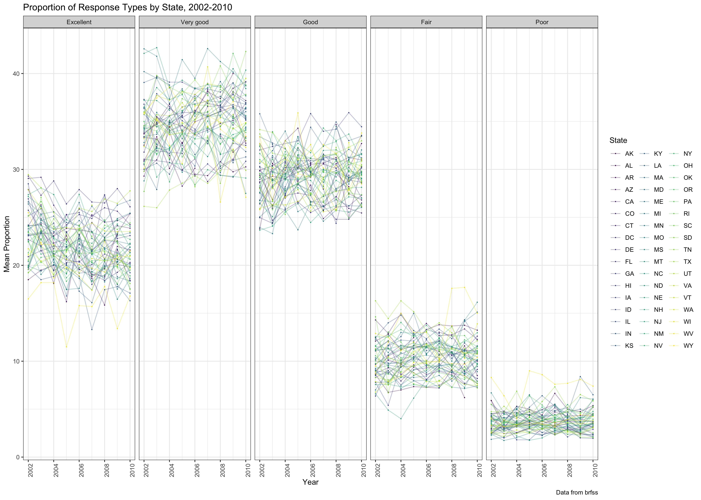

Homework 3
================

``` r
library(tidyverse)
```

    ## ── Attaching packages ────────────────────────────────────────── tidyverse 1.2.1 ──

    ## ✔ ggplot2 3.0.0     ✔ purrr   0.2.5
    ## ✔ tibble  1.4.2     ✔ dplyr   0.7.6
    ## ✔ tidyr   0.8.1     ✔ stringr 1.3.1
    ## ✔ readr   1.1.1     ✔ forcats 0.3.0

    ## ── Conflicts ───────────────────────────────────────────── tidyverse_conflicts() ──
    ## ✖ dplyr::filter() masks stats::filter()
    ## ✖ dplyr::lag()    masks stats::lag()

``` r
library(p8105.datasets)
library(ggthemes)
```

Problem 1
---------

Load BRFSS data

``` r
data(brfss_smart2010)

brfss_smart2010 <- brfss_smart2010 %>% 
  janitor::clean_names() %>% 
  rename(state = locationabbr, state_and_county = locationdesc) %>% 
  filter(topic == "Overall Health", !is.na(response)) %>%
  mutate(response = factor(response, levels = c("Excellent", "Very good", "Good", "Fair", "Poor")))
```

*In 2002, which states were observed at 7 locations?*

``` r
knitr::kable(brfss_smart2010 %>% 
  filter(year == 2002) %>% 
  group_by(state) %>% 
  distinct(state_and_county) %>% 
  tally() %>% 
  filter(n == 7)
)
```

| state |    n|
|:------|----:|
| CT    |    7|
| FL    |    7|
| NC    |    7|

Connecticut, Florida, and North Carolina were observed at 7 distinct locations in 2002.

*Make a “spaghetti plot” that shows the number of locations in each state from 2002 to 2010.*

``` r
#Save number of locations data in each state
number_locations <- brfss_smart2010 %>% 
  group_by(state, year) %>% 
  distinct(state_and_county, year) %>% 
  add_tally()

left_join(brfss_smart2010, number_locations) %>% 
  rename(n_unique_locations = n) %>%
  distinct(year, state, n_unique_locations) %>% 
  ggplot(aes(x = year, y = n_unique_locations)) +
  geom_line(aes(color = state)) + 
  theme_bw() + 
  labs(
    title = "Locations Responding to BRFSS by State, 2002-2010",
    x = "Number of Locations",
    y = "Year",
    caption = "Data from brfss"
  ) + 
  viridis::scale_color_viridis(
    name = "State", 
    discrete = TRUE
    )
```

    ## Joining, by = c("year", "state", "state_and_county")


*Make a table showing, for the years 2002, 2006, and 2010, the mean and standard deviation of the proportion of “Excellent” responses across locations in NY State.*

``` r
brfss_smart2010 %>%
  filter(response == "Excellent", year == 2002 | year == 2006 | year == 2010) %>% 
  group_by(state, year) %>% 
  summarize(mean = mean(data_value), sd = sd(data_value))
```

    ## # A tibble: 147 x 4
    ## # Groups:   state [?]
    ##    state  year  mean    sd
    ##    <chr> <int> <dbl> <dbl>
    ##  1 AK     2002  27.9 NA   
    ##  2 AL     2002  18.5 NA   
    ##  3 AL     2006  23.2 NA   
    ##  4 AL     2010  18.4  2.63
    ##  5 AR     2002  24.1 NA   
    ##  6 AR     2006  19.6  3.41
    ##  7 AR     2010  25.4  3.16
    ##  8 AZ     2002  24.1  3.54
    ##  9 AZ     2006  20.9  3.86
    ## 10 AZ     2010  21.6  5.24
    ## # ... with 137 more rows

*For each year and state, compute the average proportion in each response category (taking the average across locations in a state). Make a five-panel plot that shows, for each response category separately, the distribution of these state-level averages over time.*

``` r
brfss_smart2010 %>%
  group_by(state, year, response) %>% 
  summarize(mean = mean(data_value)) %>% 
  ggplot(aes(x = year, y = mean)) +
  geom_point(aes(color = state), size = .1) +
  geom_line(aes(color = state), alpha = .3) + 
  facet_grid( ~ response)  +
  theme_bw() + 
  theme(axis.text.x = element_text(angle = 90, hjust = 1)) +
  labs(
    title = "Proportion of Response Types by State, 2002-2010",
    x = "Year",
    y = "Mean Proportion",
    caption = "Data from brfss"
  ) + 
  viridis::scale_color_viridis(
    name = "State", 
    discrete = TRUE
    ) 
```

    ## Warning: Removed 21 rows containing missing values (geom_point).

    ## Warning: Removed 1 rows containing missing values (geom_path).


``` r
ggsave("brfss_plot.jpg", scale = 2)
```

    ## Saving 14 x 10 in image

    ## Warning: Removed 21 rows containing missing values (geom_point).

    ## Warning: Removed 1 rows containing missing values (geom_path).

That's a small version, so I'm printing a more-readable one below (from the saved plot):

``` r

```


Problem 2
---------

This problem uses the Instacart data. DO NOT include this dataset in your local data directory; instead, load the data from the p8105.datasets package (it’s called instacart).

``` r
data(instacart)
```

*The goal is to do some exploration of this dataset. To that end, write a short description of the dataset, noting the size and structure of the data, describing some key variables, and giving illustrative examples of observations.*

This large dataset contains information from Instacart, an online grocery service. Each of the 1384617 observations is an individual product ordered in a given order, with associated contextual information about the following:

-   the user, such as the days since the user has made a prior order and their ID

-   order session info, such as the index of the order in which the product was added into the cart for the given order session, and the order session's hour of day and day of week

-   the product, such as its ID, aisle, and department.

The largest order in this dataset is 80 items (using add to cart order as a proxy)! The median time of order for individual products is 2 p.m. 21 departments are represented in the data, the most popular of which is produce. The least popular is the bulk goods department.

There are 134 aisles represented in the data, the most popular of which is fresh vegetables. The least popular is the beauty aisle.

*Make a plot that shows the number of items ordered in each aisle. Order aisles sensibly, and organize your plot so others can read it.*

``` r
instacart %>%
  group_by(department, aisle, aisle_id) %>% 
  tally() %>% 
  ungroup() %>% 
  mutate(aisle = factor(aisle, levels = aisle[order(n)])) %>% 
  ggplot(aes(x = aisle, y = n, fill = department)) +
  geom_col() + 
  coord_flip() +
  theme_bw() + 
  theme(axis.text.y = element_text(size = rel(0.5))) +
  labs(
    title = "Popular Aisles",
    x = "aisle name",
    y = "order count",
    caption = "Data from instacart"
  ) + 
  viridis::scale_color_viridis(
    name = "Department", 
    discrete = TRUE
    ) 
```


``` r
ggsave("instacart_plot.jpg", scale = 2)
```

    ## Saving 14 x 10 in image

That's a small version, so I'm printing a more-readable one below (from the saved plot):

``` r
knitr::include_graphics("./instacart_plot.jpg")
```


*Make a table showing the most popular item in each of the aisles “baking ingredients”, “dog food care”, and “packaged vegetables fruits”.*

``` r
baking <- instacart %>% 
  filter(aisle == "baking ingredients") %>% 
  summarize(most_popular = names(which.max(table(product_name))))

dog_food <- instacart %>% 
  filter(aisle == "dog food care") %>% 
  summarize(most_popular = names(which.max(table(product_name))))

veg_fruit <- instacart %>% 
  filter(aisle == "packaged vegetables fruits") %>% 
  summarize(most_popular = names(which.max(table(product_name))))

knitr::kable(rbind(baking, dog_food, veg_fruit) %>% 
  mutate(aisle = c("baking ingredients", "dog food care", "packaged vegetables fruits"))
)
```

| most\_popular                                 | aisle                      |
|:----------------------------------------------|:---------------------------|
| Light Brown Sugar                             | baking ingredients         |
| Snack Sticks Chicken & Rice Recipe Dog Treats | dog food care              |
| Organic Baby Spinach                          | packaged vegetables fruits |

*Make a table showing the mean hour of the day at which Pink Lady Apples and Coffee Ice Cream are ordered on each day of the week; format this table for human readers (i.e. produce a 2 x 7 table).*

``` r
instacart %>% 
    filter(product_name == "Pink Lady Apples" | product_name == "Coffee Ice Cream") %>%
    group_by(order_dow, product_name) %>% 
    summarize(mean_hour = mean(order_hour_of_day)) %>% 
    ungroup() %>% 
    arrange(product_name) %>% 
    spread(key = product_name, value = mean_hour) %>% 
    mutate(order_dow = replace(order_dow, 1:7, c("sunday", "monday", "tuesday", "wednesday", "thursday", "friday", "saturday"))) %>% 
    rename('Order Day of Week' = order_dow) %>% 
  knitr::kable(caption = "Mean Hour of Day Order Placed (x/24h)")
```

| Order Day of Week |  Coffee Ice Cream|  Pink Lady Apples|
|:------------------|-----------------:|-----------------:|
| sunday            |          13.77419|          13.44118|
| monday            |          14.31579|          11.36000|
| tuesday           |          15.38095|          11.70213|
| wednesday         |          15.31818|          14.25000|
| thursday          |          15.21739|          11.55172|
| friday            |          12.26316|          12.78431|
| saturday          |          13.83333|          11.93750|
